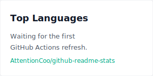
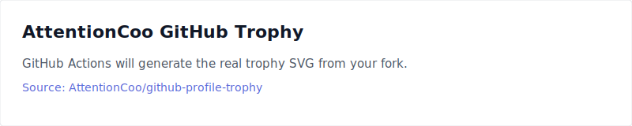

# Hi, I'm AttentionCoo

<p align="center">
  
</p>

<p align="center">
  
  
  
  
</p>

<p align="center">
  <a href="https://github.com/AttentionCoo">
    
  </a>
  
  
  
</p>

---

## About Me

AI Researcher & Algorithm Engineer

I am a research-oriented AI practitioner working at the intersection of computer vision, deep learning, and large language model systems.

Focused on:

- Computer Vision Research
- Large Language Models (LLM)
- Deep Learning
- Retrieval Augmented Generation (RAG)
- AI Agent & Multi-Agent Systems
- Backend Engineering

Currently building:

> Production-ready AI applications powered by LLM Agents and RAG.

Research interests:

- Transformer Architecture
- Parameter Efficient Fine-Tuning (PEFT)
- Model Quantization
- Multimodal AI
- Intelligent Agent Systems

---

## Research Highlights

- One paper accepted by CVPR.
- Research work centered on computer vision, deep learning, and intelligent AI systems.

---

## Tech Stack

### AI / Deep Learning

<p>
  
</p>

<p>
  
  
  
</p>

AI Framework:

```text
PyTorch
Transformers
LangChain
LangGraph
LlamaIndex
Ollama
FastAPI
```

---

## Backend Engineering

<p>
  
</p>

Backend:

```text
Spring Boot
Spring Cloud
MyBatis
Redis
MySQL
RabbitMQ
Docker
Linux
```

---

## GitHub Statistics

<p align="center">
  
  
</p>

<p align="center">
  
</p>

---

## Featured Projects

### Medical Multi-Agent System

AI-powered clinical decision support system.

Features:

- Medical RAG
- Multi-Agent Reasoning
- Knowledge Retrieval
- LLM Clinical Analysis

---

### Learning Multi-Agent System

Research project exploring:

- Agent Collaboration
- Memory Architecture
- Tool Calling
- Workflow Orchestration

---

## GitHub Trophy

<p align="center">
  
</p>

---

<p align="center">
  Building intelligent systems with AI
</p>
