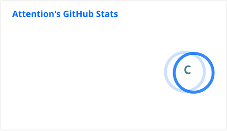
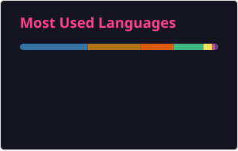
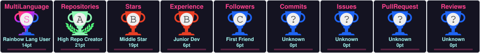

<!-- ===================== Header banner ===================== -->

  

<!-- ===================== Typing intro (readme-typing-svg) ===================== -->

  

<!-- ===================== Character gallery ===================== -->

  
  
  
  

<!-- ===================== Social & status badges ===================== -->

  
  
  
  
  
  
  

---

## 🧑‍💻 About Me

> Deep learning & LLM algorithm engineer with a solid Java backend foundation — building production-ready AI agent systems.

- 🔭 **Currently building:** [MedLLM](https://github.com/AttentionCoo/stroke-multi-agent-cdss) — a stroke multi-agent clinical decision support system, and [LearnAgent](https://github.com/AttentionCoo/learning-characterizing-mas) — a personalized medical-education multi-agent system
- 🧠 **Focused on:** Computer Vision, Large Language Models, RAG, AI Agent & Multi-Agent Systems, Backend Engineering
- 🎯 **Research interests:** Transformer architecture, model fine-tuning (PEFT), inference optimization, multimodal AI
- 📄 **Publication:** 1 paper accepted by CVPR
- 💬 **Ask me anything:** [open an issue](https://github.com/AttentionCoo/AttentionCoo/issues) and let's talk

---

## 🔬 Research Highlights

  
  
  
  
  

- 📄 **1 paper accepted by CVPR**
- 🔭 Research work centered on computer vision, deep learning, and intelligent AI systems

---

## 📌 Featured Projects

### 🏥 MedLLM · 脑卒中多智能体临床辅助决策系统

Role-playing **multi-agent stroke CDSS** — evidence-first, process-transparent, clinically audited.

- 🧑‍⚕️ **Multi-expert matrix collaboration** — GP / neurologist / clinical pharmacist debate through cross-examination, converging on a chair-moderated, auditable consensus (LangGraph)
- 🔎 **Deep-customized Hybrid RAG** — ChromaDB + BM25 dual retrieval, 5 theme-isolated collections, RRF fusion, medical evidence re-ranking, agentic retrieval loops, RAGAS benchmarks
- ⚡ **Full-stack SSE streaming** — chain-of-thought rendered live, three experts' opinions scroll in parallel
- 🛠️ **8 built-in stroke tools** — NIHSS / mRS / GCS scales, rt-PA dosing, thrombolysis time windows, TOAST & LVO screening
- 🧠 **3-tier patient memory** — short-term / episodic / semantic memory with doctor-side audit
- 🧰 **Stack** — Vue 3.5 · Spring Boot · FastAPI · LangGraph · Redis · MySQL · Docker

### 🎓 LearnAgent · 医学教育学习多智能体系统

Personalized **multi-agent learning system for stroke medical education**, powered by 9 expert agents.

- 👤 **8-dimension learner profiling** and 8 types of resource generation — lectures, mind-maps, exercises, clinical cases, study plans and more
- 🗺️ **Learning-path planning** — dynamic adjustment, progress tracking and resource recommendation
- 🖼️ **Medical multimodality** — Qwen-VL image analysis, multi-image comparison, DICOM metadata and OCR of prescriptions & lab reports
- ⚖️ **Quality control** — hybrid RAG, rule validation, reflection-correction and debate arbitration over auditable SSE streams
- 🧰 **Stack** — Vue 3.5 · Vite · Java 21 · Spring Boot 3 · MyBatis-Plus · FastAPI · LangGraph · ChromaDB · Qwen

### ⚙️ More AI Projects

| 👔 [SuperBizAgent](https://github.com/AttentionCoo/super-biz-agent) | 🔭 [Space-RAG](https://github.com/AttentionCoo/space-rag-model) |
| :--- | :--- |
| Enterprise chatbot & AIOps assistant — RAG knowledge base, Plan-Execute-Replan fault diagnosis, MCP tool integration. `FastAPI · LangChain · LangGraph · Milvus` | Astronomy multi-source RAG Q&A — BM25 + M3E hybrid retrieval over a local astronomy PDF vector DB, Wikipedia internal corpus and real-time Google Serper search, orchestrated by an AI Agent. |

| 🚢 [Titanic FT-Transformer](https://github.com/AttentionCoo/Titanic-FT-Transformer) | 📈 [Store Sales Forecasting](https://github.com/AttentionCoo/store-sales---time-series-forecasting) |
| :--- | :--- |
| FT-Transformer (Feature Tokenizer + Transformer) — Title/FamilySize/Deck feature engineering, DropPath regularization + feature residual, 5-fold CV **84.51% ± 1.24%**. | LightGBM time-series forecasting — high-order lag/rolling features, multi-source merge (oil / holidays / stores / transactions), log1p target, strict time-split validation (RMSLE). |

### 🛠️ Tools & Collections

- 🧬 [scrapy-ncbi](https://github.com/AttentionCoo/scrapy-ncbi) — async Scrapy crawler for NCBI literature (PubMed / PMC / Gene / BLAST), random User-Agent middleware with polite rate limiting
- 📖 [study-note](https://github.com/AttentionCoo/study-note) — personal knowledge base covering AI / LLM agents, Java backend, middleware and CS basics, with code examples
- 💎 [anime-gems](https://github.com/AttentionCoo/anime-gems) — curated collection of beautiful anime artworks

---

## 🛠️ Tech Stack

### 🧠 AI & Deep Learning

  

  
  
  
  
  
  
  

### 🧩 LLM & Agent Frameworks

  
  
  
  
  
  
  
  

### ☕ Backend Engineering

  

  
  
  
  
  
  
  
  
  
  
  
  
  

---

## 📊 GitHub Statistics

  
  

  

---

## 🏆 GitHub Trophy

  

---

<!-- ===================== Footer ===================== -->

  

  Building intelligent systems with AI ⚡

